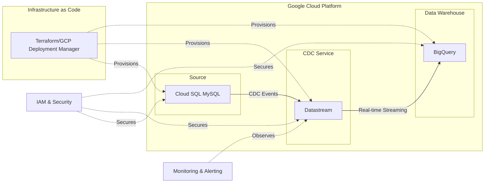

# GCP Change Data Capture Pipeline

[](https://www.terraform.io/)
[](https://cloud.google.com/)

A real-time data replication pipeline that captures Change Data Capture (CDC) events from Cloud SQL MySQL database using Datastream and streams them into BigQuery for analytics and data warehousing.

## Architecture



## Overview

This project implements a serverless Change Data Capture (CDC) pipeline using Google Cloud Platform services to enable real-time data synchronization:

- **Source Database**: Cloud SQL MySQL with binary logging enabled for CDC
- **CDC Streaming**: Datastream captures database changes in real-time
- **Data Warehouse**: BigQuery stores replicated data for analytics and reporting
- **Infrastructure**: All GCP resources provisioned using Infrastructure as Code

## Features

- **Real-time CDC**: Capture insert, update, and delete operations as they happen
- **Zero-ETL**: Direct streaming from transactional database to analytical warehouse
- **Schema Evolution**: Automatic handling of schema changes
- **High Availability**: Built-in redundancy and fault tolerance
- **Scalable Architecture**: Auto-scaling based on data volume and velocity
- **Cost-Effective**: Serverless, pay-per-use pricing model

## Prerequisites

- Google Cloud Platform account with billing enabled
- gcloud CLI installed and configured
- Terraform >= 1.0 (if using Terraform for IaC)
- Appropriate GCP permissions for Cloud SQL, Datastream, and BigQuery

## Project Structure

```
├── terraform/
│   ├── main.tf
│   ├── variables.tf
│   ├── outputs.tf
│   ├── cloud-sql.tf
│   ├── datastream.tf
│   ├── bigquery.tf
│   └── terraform.tfvars.example
├── sql/
│   ├── schema.sql
│   └── sample-data.sql
├── monitoring/
│   ├── alerts.yaml
│   └── dashboards/
├── README.md
└── .gitignore
```

## Setup Instructions

### 1. Clone the Repository

```bash
git clone <repository-url>
cd gcp-cdc-pipeline
```

### 2. Configure GCP Authentication

```bash
gcloud auth login
gcloud config set project <your-project-id>
gcloud auth application-default login
```

### 3. Enable Required APIs

```bash
gcloud services enable sqladmin.googleapis.com
gcloud services enable datastream.googleapis.com
gcloud services enable bigquery.googleapis.com
gcloud services enable compute.googleapis.com
```

### 4. Deploy Infrastructure

```bash
cd terraform
cp terraform.tfvars.example terraform.tfvars
# Edit terraform.tfvars with your specific values
terraform init
terraform plan
terraform apply
```

### 5. Configure Cloud SQL for CDC

Enable binary logging on your Cloud SQL MySQL instance:

```bash
gcloud sql instances patch <instance-name> \
    --database-flags=log_bin=on,binlog_format=row,binlog_row_image=full
```

### 6. Create Source Database Schema

```bash
mysql -h <cloud-sql-ip> -u <username> -p < sql/schema.sql
```

## Configuration

### Terraform Variables

Key variables to configure in `terraform.tfvars`:

```hcl
project_id = "your-gcp-project-id"
region = "us-central1"
zone = "us-central1-a"

# Cloud SQL Configuration
cloudsql_instance_name = "source-mysql-db"
database_name = "production"
database_user = "datastream_user"

# Datastream Configuration
datastream_id = "mysql-to-bigquery-stream"
datastream_location = "us-central1"

# BigQuery Configuration
bigquery_dataset_id = "replicated_data"
bigquery_location = "US"
```

### Cloud SQL Configuration

Required MySQL configuration for CDC:

```sql
-- Enable binary logging (done via gcloud command above)
-- Create dedicated user for Datastream
CREATE USER 'datastream_user'@'%' IDENTIFIED BY 'secure_password';
GRANT SELECT, RELOAD, SHOW DATABASES, REPLICATION SLAVE, REPLICATION CLIENT ON *.* TO 'datastream_user'@'%';
FLUSH PRIVILEGES;
```

### Datastream Configuration

Key configuration parameters:

- **Source**: Cloud SQL MySQL instance
- **Destination**: BigQuery dataset
- **Stream Mode**: CDC (Change Data Capture)
- **Include/Exclude Lists**: Specify tables to replicate

## Architecture Components

### Cloud SQL MySQL
- **Purpose**: Source transactional database
- **Configuration**: Binary logging enabled for CDC
- **Security**: Private IP, authorized networks, SSL enforcement
- **Backup**: Automated backups and point-in-time recovery

### Datastream
- **Purpose**: Real-time CDC streaming service
- **Features**: Schema detection, data validation, error handling
- **Monitoring**: Built-in metrics and logging
- **Scaling**: Automatic scaling based on data volume

### BigQuery
- **Purpose**: Target data warehouse for analytics
- **Features**: Columnar storage, SQL analytics, ML integration
- **Partitioning**: Time-based partitioning for optimal performance
- **Security**: Dataset-level access controls and encryption

## Data Flow

1. **Change Detection**: Datastream monitors MySQL binary logs
2. **Change Capture**: CDC events (INSERT, UPDATE, DELETE) are captured
3. **Data Transformation**: Optional transformations during streaming
4. **Data Loading**: Changes are streamed to BigQuery tables
5. **Schema Sync**: Table schemas are automatically synchronized

## Monitoring and Observability

### Cloud Monitoring Metrics

Key metrics to monitor:

- **Datastream throughput**: Records per second
- **Replication lag**: Time delay between source and destination
- **Error rates**: Failed operations and retries
- **Resource utilization**: CPU, memory, and network usage

### Alerting

Configure alerts for:

```yaml
# Example alert policy
- name: "High Replication Lag"
  condition: "datastream_replication_lag > 300s"
  notification: "ops-team@company.com"

- name: "Stream Failure"
  condition: "datastream_status != 'RUNNING'"
  notification: "critical-alerts@company.com"
```

### Dashboards

Monitor your pipeline with custom dashboards:

- **Stream Health**: Status, throughput, and error rates
- **Replication Metrics**: Lag, volume, and performance
- **Cost Analysis**: Resource usage and billing trends

## Security

### Access Control
- **IAM Roles**: Principle of least privilege
- **Service Accounts**: Dedicated accounts for each component
- **Network Security**: Private connectivity where possible

### Data Protection
- **Encryption**: Data encrypted in transit and at rest
- **Access Logging**: Audit trails for all data access
- **Data Masking**: PII protection in non-production environments

### Network Security
```hcl
# Example VPC configuration
resource "google_compute_network" "vpc" {
  name                    = "datastream-vpc"
  auto_create_subnetworks = false
}

resource "google_compute_subnetwork" "private_subnet" {
  name          = "datastream-subnet"
  ip_cidr_range = "10.0.0.0/24"
  region        = var.region
  network       = google_compute_network.vpc.id
  
  private_ip_google_access = true
}
```

## Performance Optimization

### BigQuery Optimization
- **Partitioning**: Partition tables by timestamp
- **Clustering**: Cluster frequently queried columns
- **Materialized Views**: Pre-compute common aggregations

### Cost Optimization
- **Slot Reservations**: Predictable BigQuery pricing
- **Storage Classes**: Optimize Cloud SQL storage
- **Lifecycle Policies**: Archive old data automatically

## Troubleshooting

### Common Issues

1. **Replication Lag**
   ```bash
   # Check Datastream status
   gcloud datastream streams describe <stream-id> --location=<location>
   ```

2. **Connection Issues**
   ```bash
   # Test Cloud SQL connectivity
   gcloud sql connect <instance-name> --user=<username>
   ```

3. **Schema Sync Problems**
   ```bash
   # Check BigQuery table schema
   bq show --schema <dataset>.<table>
   ```

### Monitoring Commands

```bash
# List Datastream streams
gcloud datastream streams list --location=<location>

# Check stream status
gcloud datastream streams describe <stream-id> --location=<location>

# Query BigQuery for recent changes
bq query --use_legacy_sql=false '
SELECT _metadata_timestamp, _metadata_change_type, *
FROM `<project>.<dataset>.<table>`
ORDER BY _metadata_timestamp DESC
LIMIT 100'
```

## Data Validation

Validate data consistency between source and destination:

```sql
-- Compare record counts
SELECT 
  'Cloud SQL' as source, COUNT(*) as record_count 
FROM production.users
UNION ALL
SELECT 
  'BigQuery' as source, COUNT(*) as record_count 
FROM `project.replicated_data.users`;
```

## Best Practices

### Database Design
- Use appropriate primary keys for CDC tracking
- Avoid frequent schema changes during streaming
- Monitor table sizes and growth patterns

### Operational Excellence
- Implement proper monitoring and alerting
- Regular testing of disaster recovery procedures
- Documentation of operational runbooks

### Cost Management
- Monitor BigQuery slot usage
- Implement data retention policies
- Regular cost analysis and optimization

## Contributing

1. Fork the repository
2. Create a feature branch (`git checkout -b feature/amazing-feature`)
3. Commit your changes (`git commit -m 'Add some amazing feature'`)
4. Push to the branch (`git push origin feature/amazing-feature`)
5. Open a Pull Request

## License

This project is licensed under the MIT License - see the [LICENSE](LICENSE) file for details.

## Support

For questions and support:

- Create an issue in this repository
- Check Google Cloud documentation for service-specific questions
- Review Cloud Logging for debugging information

## Cleanup

To avoid ongoing charges, destroy the infrastructure when no longer needed:

```bash
cd terraform
terraform destroy
```

**Warning**: This will delete all resources including databases and data. Ensure you have proper backups before proceeding.

## Additional Resources

- [Datastream Documentation](https://cloud.google.com/datastream/docs)
- [Cloud SQL Best Practices](https://cloud.google.com/sql/docs/mysql/best-practices)
- [BigQuery CDC Patterns](https://cloud.google.com/bigquery/docs/change-data-capture)
- [GCP Security Best Practices](https://cloud.google.com/security/best-practices)
